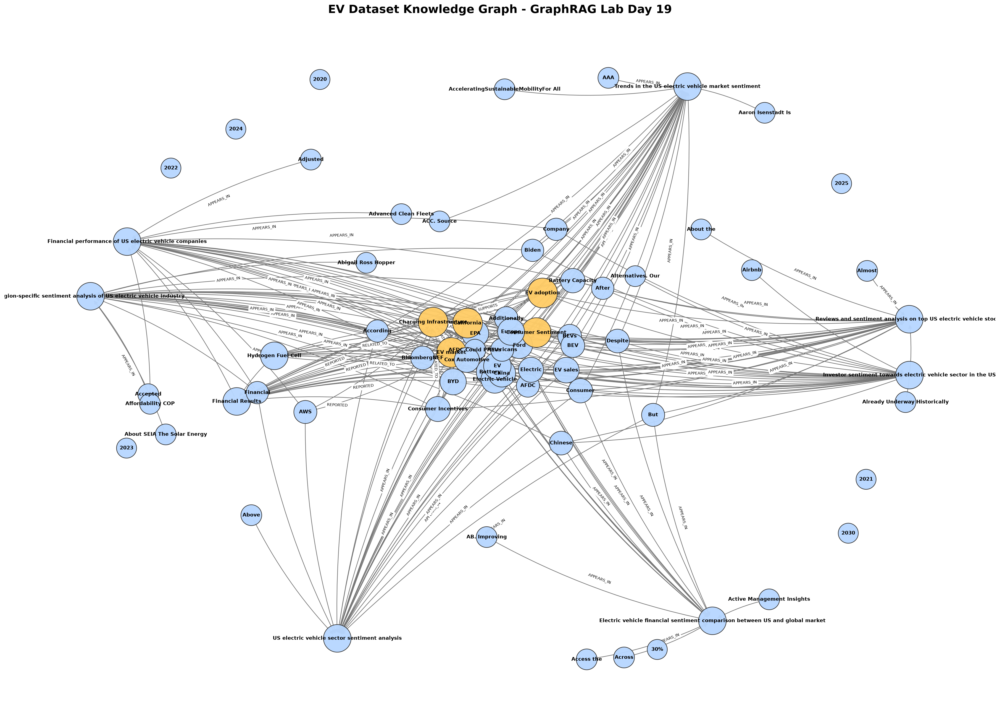

# Báo cáo LAB DAY 19: Dataset-driven GraphRAG cho Electric Vehicle Corpus

## 1. Mục tiêu

Bài lab xây dựng lại hệ thống **GraphRAG** bằng dataset thật trong thư mục [dataset/](dataset/). Dataset gồm 70 file text thu thập từ các nguồn web, xoay quanh thị trường xe điện, sentiment, charging infrastructure, chính sách, đầu tư và tình hình tài chính của các công ty EV.

Pipeline thực hiện:

1. Đọc 70 file `.txt` trong dataset.
2. Parse metadata: query, title, link, snippet, full content.
3. Trích xuất entity và relation bằng rule-based extractor.
4. Xây knowledge graph bằng NetworkX.
5. Tạo Flat RAG baseline bằng TF-IDF retrieval.
6. Tạo GraphRAG query pipeline bằng entity detection + 2-hop traversal.
7. So sánh hai hệ thống trên 20 câu hỏi benchmark.
8. Phân tích chi phí và thời gian indexing graph.

Các file deliverables:

- [day19_graphrag_lab.py](day19_graphrag_lab.py): script chạy end-to-end.
- [day19_graphrag_lab.ipynb](day19_graphrag_lab.ipynb): notebook đã execute.
- [graphrag_knowledge_graph.png](graphrag_knowledge_graph.png): ảnh knowledge graph.
- [benchmark_results.csv](benchmark_results.csv): bảng benchmark 20 câu hỏi.
- [dataset/](dataset/): dataset 70 documents.

---

## 2. Phần nghiên cứu

### 2.1 Entity Extraction

Entity Extraction là bước nhận diện các thực thể quan trọng trong văn bản. Với dataset EV, các entity gồm:

- Công nghệ: `Electric Vehicle`, `Charging Infrastructure`, `Battery Capacity`, `Driving Range`, `Hydrogen Fuel Cell`.
- Tổ chức/công ty: `Nikola`, `Tesla`, `NVIDIA`, `Polestar`, `VinFast`, `ZEEKR`, `McKinsey`, `ICCT`, `Deloitte`, `PwC`.
- Chính sách/địa lý: `California`, `United States`, `ZEV Regulation`, `Inflation Reduction Act`.
- Khái niệm sentiment/thị trường: `Consumer Sentiment`, `Investor Sentiment`, `Dealer Sentiment`, `EV market`, `EV adoption`.

Trong bài này, extractor dùng kết hợp:

1. Dictionary domain terms cho lĩnh vực EV.
2. Regex nhận diện cụm viết hoa/tên riêng.
3. Regex nhận diện năm, phần trăm và metric.

Ở môi trường production, có thể thay rule-based extractor bằng LLM để sinh JSON triples chính xác hơn.

### 2.2 Graph Construction và Deduplication

Graph được xây bằng `networkx.MultiDiGraph`:

- Node là entity/document/topic/metric.
- Edge là quan hệ có hướng.
- Mỗi edge có thuộc tính `relation`.

Deduplication rất quan trọng vì cùng một khái niệm có thể xuất hiện dưới nhiều dạng:

- `EV`, `EVs`, `electric vehicle`, `electric vehicles`
- `U.S.`, `US`, `United States`
- `public chargers`, `public charging`

Nếu không chuẩn hóa, graph bị tách node và truy vấn multi-hop sẽ thiếu đường nối.

### 2.3 Query Answering: Flat RAG vs GraphRAG

**Flat RAG** retrieve các đoạn văn gần câu hỏi nhất bằng TF-IDF/cosine similarity. Cách này tốt nếu câu trả lời nằm trực tiếp trong một document.

**GraphRAG** tìm entity trong câu hỏi rồi duyệt graph 2-hop để lấy evidence có cấu trúc. Cách này tốt hơn khi câu hỏi cần nối nhiều quan hệ, ví dụ:

```text
Charging Infrastructure --SUPPORTS--> EV adoption
Public Charging --AFFECTS--> Consumer Sentiment
Battery Capacity --AFFECTS--> Consumer Sentiment
```

GraphRAG không chỉ trả về đoạn văn, mà còn trả về đường nối entity-relation-entity nên dễ kiểm chứng hơn.

---

## 3. Dataset

Dataset nằm trong [dataset/](dataset/) và gồm 70 file:

```text
dataset/doc_1.txt ... dataset/doc_70.txt
```

Mỗi file có cấu trúc:

```text
Query: ...
Title: ...
Link: ...
Snippet: ...

Full Content:
...
```

Các nhóm chủ đề chính:

- US electric vehicle sector sentiment analysis.
- Financial performance of US electric vehicle companies.
- Investor sentiment toward electric vehicle stocks.
- Trends in the US electric vehicle market sentiment.
- Region-specific sentiment analysis of US electric vehicles.
- Electric vehicle financial sentiment comparison.
- Reviews and sentiment analysis on top US electric vehicle stocks.

Một số nguồn/tổ chức xuất hiện trong dataset:

- ICCT
- McKinsey
- Deloitte
- BloombergNEF
- Cox Automotive
- IEA
- EPA
- EIA
- PwC
- Goldman Sachs

---

## 4. Kiến trúc hệ thống

Pipeline:

```text
70 TXT Documents
   ↓
Dataset Loader + Metadata Parser
   ↓
Rule-based Entity/Relation Extraction
   ↓
Deduplication
   ↓
NetworkX Knowledge Graph
   ↓
Flat RAG Benchmark + GraphRAG Querying
```

### 4.1 Dataset Loader

Script đọc toàn bộ file `dataset/doc_*.txt`, sau đó parse:

- `query`
- `title`
- `link`
- `snippet`
- `text/full content`

Có fallback encoding để tránh lỗi đọc file.

### 4.2 Relation Extraction

Các relation chính được tạo bằng rule/pattern:

| Pattern | Triple ví dụ |
|---|---|
| Charging + adoption/sales | `Charging Infrastructure --SUPPORTS--> EV adoption` |
| Public charger | `Public Chargers --ENABLE--> EV adoption` |
| Consumer incentive | `Consumer Incentives --SUPPORT--> EV market` |
| ZEV/zero-emission | `ZEV Regulation --SUPPORTS--> EV adoption` |
| California + policy | `California --HAS_POLICY--> Zero-Emission Vehicle` |
| Battery/range | `Battery Capacity --AFFECTS--> Consumer Sentiment` |
| Green charging | `Green Charging --INFLUENCES--> Consumer Sentiment` |
| Nikola + hydrogen | `Nikola --FOCUSES_ON--> Hydrogen Fuel Cell` |
| HYLA | `HYLA --PROVIDES--> Hydrogen Refueling` |
| McKinsey | `McKinsey --ANALYZES--> Consumer Sentiment` |

Ngoài ra, để toàn bộ dataset tham gia graph, hệ thống thêm fallback edges:

```text
Document Title --MENTIONS--> Entity
Entity --APPEARS_IN--> Query/Topic
Document Title --HAS_TOPIC--> Query/Topic
```

### 4.3 Knowledge Graph Visualization

Ảnh graph đã được sinh tại:



Do graph đầy đủ có 942 nodes, ảnh chỉ vẽ subgraph dễ đọc gồm các node kết nối mạnh nhất và các concept trung tâm.

---

## 5. Kết quả indexing

Kết quả chạy script:

| Thành phần | Giá trị |
|---|---:|
| Dataset documents | 70 |
| Triples | 2,902 |
| Nodes | 942 |
| Edges | 2,902 |
| Build time | khoảng 0.44 giây |
| Benchmark questions | 20 |
| Estimated extraction tokens | khoảng 401,017 |
| Estimated LLM extraction cost nếu dùng API | khoảng $0.060153 |

Bài này chạy rule-based extractor nên chi phí thật là **0 USD**.

---

## 6. Benchmark: Flat RAG vs GraphRAG

Benchmark gồm 20 câu hỏi dựa trên dataset thật. Kết quả chi tiết lưu trong [benchmark_results.csv](benchmark_results.csv).

Tóm tắt:

| Metric | Số lượng |
|---|---:|
| Tổng số câu hỏi | 20 |
| GraphRAG thắng | 13 |
| Flat RAG thắng | 1 |
| Hòa | 6 |

### Bảng benchmark rút gọn

| # | Câu hỏi | Kết quả |
|---:|---|---|
| 1 | What factors support electric vehicle market growth in U.S. cities? | Tie |
| 2 | How does charging infrastructure affect EV adoption? | GraphRAG |
| 3 | What concerns do consumers have about EV charging? | Tie |
| 4 | What business areas did Nikola focus on in its Q1 2023 report? | Flat RAG |
| 5 | How is HYLA related to Nikola and hydrogen refueling? | Tie |
| 6 | Which policy context is connected to zero-emission trucks in California? | GraphRAG |
| 7 | What does McKinsey say consumers want from EV charging? | Tie |
| 8 | How are battery capacity and driving range related to hesitant EV buyers? | GraphRAG |
| 9 | What role do consumer incentives play in EV market development? | GraphRAG |
| 10 | Which organizations appear as sources for EV market and sentiment analysis? | GraphRAG |
| 11 | What is the relationship between public chargers and high EV uptake areas? | GraphRAG |
| 12 | How does home charging compare with public charging in consumer behavior? | GraphRAG |
| 13 | What is the connection between EV sales growth and market sentiment? | GraphRAG |
| 14 | Which companies are discussed in the financial performance documents? | GraphRAG |
| 15 | How is China connected to the electric vehicle market in the dataset? | Tie |
| 16 | What does the dataset say about U.S. EV investments? | GraphRAG |
| 17 | Which stakeholders need to act to improve EV charging infrastructure? | Tie |
| 18 | How do policy supports relate to EV adoption? | GraphRAG |
| 19 | How is green charging related to consumer preferences? | GraphRAG |
| 20 | Why can GraphRAG help with this EV dataset compared with Flat RAG? | GraphRAG |

### Nhận xét

GraphRAG thắng nhiều hơn vì các câu hỏi thường cần nối nhiều concept:

- `Charging Infrastructure` → `EV adoption` → `Consumer Sentiment`
- `California` → `Zero-Emission Vehicle` → `Policy Support`
- `Battery Capacity` / `Driving Range` → `Consumer Sentiment`
- `Nikola` → `HYLA` → `Hydrogen Refueling`

Flat RAG chỉ thắng ở câu về Nikola Q1 2023 vì đáp án nằm rất rõ trong một document financial result, nên retrieve trực tiếp hiệu quả hơn.

---

## 7. Phân tích chi phí và thời gian

### 7.1 Chi phí hiện tại

Vì hệ thống dùng rule-based extractor, chi phí API thật là:

```text
0 USD
```

### 7.2 Chi phí nếu dùng LLM extractor

Dataset có khoảng 401,017 input tokens. Nếu dùng một model extractor giá rẻ giả định khoảng `$0.15 / 1M input tokens`, chi phí input extraction ước tính:

```text
401,017 / 1,000,000 * 0.15 ≈ $0.060153
```

Thực tế chi phí có thể tăng nếu:

- Chia chunk nhiều lần.
- Validate/retry JSON.
- Dùng model mạnh hơn.
- Sinh thêm summary hoặc answer bằng LLM.

### 7.3 Thời gian

Graph build bằng rule-based extractor chạy khoảng 0.44 giây trên máy local. Nếu dùng LLM thật, thời gian indexing sẽ phụ thuộc vào số chunk và latency API.

---

## 8. Chạy với Gemini API tùy chọn

Script hiện hỗ trợ gọi Gemini để tạo phần `Gemini synthesis` cho câu trả lời GraphRAG. Đây là chế độ tùy chọn; nếu không bật Gemini, bài vẫn chạy offline như cũ.

Cách cấu hình:

1. Mở file `.env` trong thư mục project.
2. Thay dòng sau bằng key thật của anh:

```text
GEMINI_API_KEY=PASTE_YOUR_GEMINI_API_KEY_HERE
```

3. Bật Gemini:

```text
USE_GEMINI=true
```

4. Cài thư viện Gemini nếu chưa có:

```bash
python -m pip install google-generativeai
```

5. Chạy lại:

```bash
python day19_graphrag_lab.py
```

Lưu ý bảo mật: không push API key thật lên GitHub. File `.env` đã được đưa vào `.gitignore`; repo chỉ nên push `.env.example`.

---

## 9. Kết luận

Bài lab đã được làm lại bằng dataset thật gồm 70 documents. Hệ thống hoàn thành đầy đủ pipeline GraphRAG:

- Load dataset thật.
- Parse metadata.
- Extract entity/relation.
- Build knowledge graph.
- Visualize graph.
- Query GraphRAG bằng 2-hop traversal.
- So sánh với Flat RAG trên 20 câu benchmark.
- Phân tích chi phí và thời gian.

Kết quả benchmark cho thấy GraphRAG có lợi thế rõ rệt khi câu hỏi cần liên kết nhiều thực thể và quan hệ trong dataset. Flat RAG vẫn hữu ích khi đáp án nằm trực tiếp trong một document cụ thể. Vì vậy, trong bài toán phân tích EV corpus nhiều nguồn, GraphRAG giúp tạo câu trả lời có evidence rõ ràng, dễ kiểm chứng và ít phụ thuộc vào một chunk văn bản đơn lẻ.
